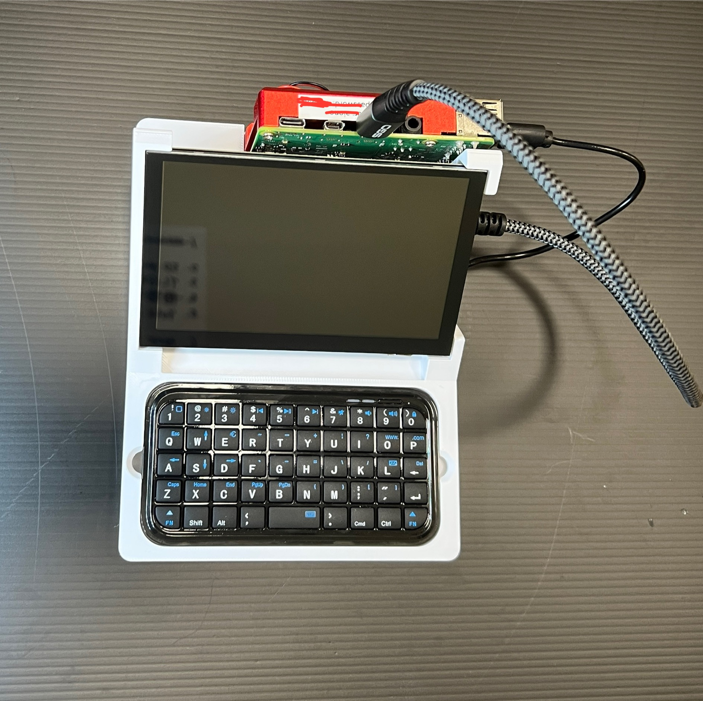

# Raspberry-Pi-with-screen-and-keyboard-3D-print
A complete 3D print case that integrate Raspberry Pi with a screen and keyboard

Picture of the complete set. More pictures will be released soon.

The case file for 3DP can be downloaded below. Or you can navigate to 3DPfile folder under this repository to get the file. (Raspberry Pi 5 case will be released soon)
👉 [Download the 3DP file](https://github.com/MiaoReynolds/Raspberry-Pi-with-screen-and-keyboard-3D-print/raw/main/3DPfile/)
---
| Parts | Link |
|--------|------|
｜ Screen ｜ Link: ｜
｜ Keyboard ｜ Link: ｜
